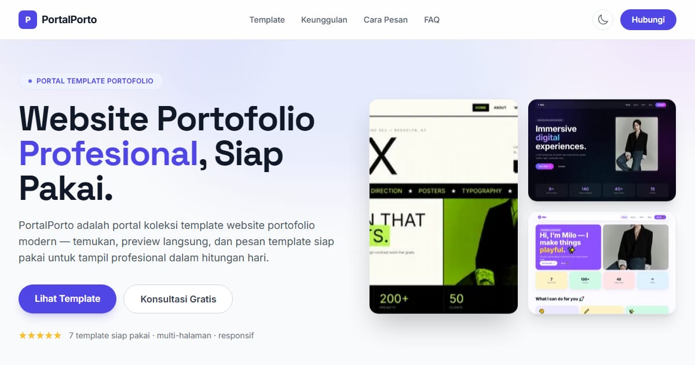

# PortalPorto — Galeri Portfolio Personal

PortalPorto: koleksi 7 template portfolio personal dengan karakter berbeda — untuk desainer, developer, dan kreator.

**Demo live:** https://www.pintuweb.com/website-portofolio



> Katalog demo milik PintuWeb. Setiap kartu menautkan ke demo live yang bisa dicoba.

## Konsep

Katalog template portfolio. Hero bento, kartu berbingkai browser yang menggulir pratinjau halaman penuh saat disorot, modal detail, dan mode gelap.

- Isi katalog ada di `app/data/templates.js`. Setiap template punya 14 halaman (5 halaman utama, 6 studi kasus, 3 artikel); Carlos menambah Privasi & Ketentuan.
- Durasi dan harga di FAQ mengikuti paket Portofolio di `PintuWeb/app/lib/packages.ts` (3–5 hari kerja, Rp1,5–2,5 juta). Ubah di sana dulu bila berubah.
- Tanpa testimoni atau rating bintang: portal ini belum punya ulasan pelanggan sungguhan.
- Pratinjau `public/templates/p<n>.webp` (1280×880 @2x) dan `f<n>.webp` (halaman penuh, lebar 900) diambil dari build tiap varian; urutan n: noelle, carlos, sorelle, aria, rex, celeste, milo.

## Varian yang dipamerkan (7)

- [Aria](https://portfolio-aria-pearl.vercel.app)
- [Carlos Mendoza](https://portfolio-carlos-eosin.vercel.app)
- [Celeste](https://portfolio-celeste-one.vercel.app)
- [Milo](https://portfolio-milo.vercel.app)
- [Noelle](https://portfolio-noelle-one.vercel.app)
- [Rex](https://portfolio-rex-zeta.vercel.app)
- [Sorelle](https://portfolio-sorelle.vercel.app)

## Halaman

`/`

## Teknologi

- Next.js 15.5 (App Router) dan React 19
- Tailwind CSS v3
- JavaScript
- Headless UI, Heroicons, Framer Motion, next-themes (mode gelap)
- Font: Inter, Space Grotesk (next/font)
- SEO: metadata per halaman, Open Graph, JSON-LD, sitemap.xml, dan robots.txt

## Menjalankan secara lokal

```bash
npm install
npm run dev
```

Buka http://localhost:3000. Untuk build produksi: `npm run build` lalu `npm start`.

---

Dibuat oleh [PintuWeb](https://www.pintuweb.com), jasa pembuatan website.
